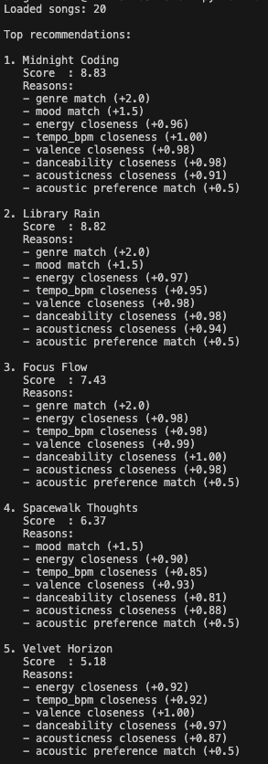
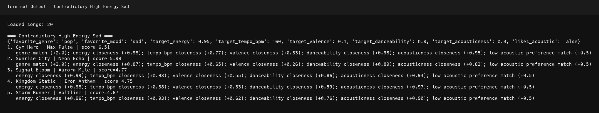
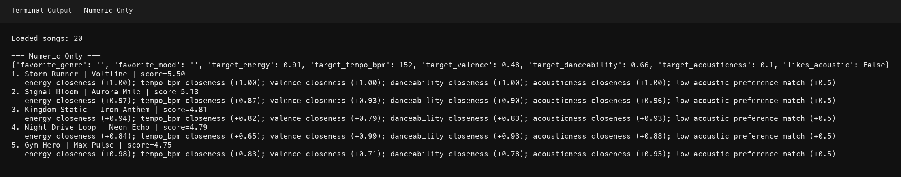
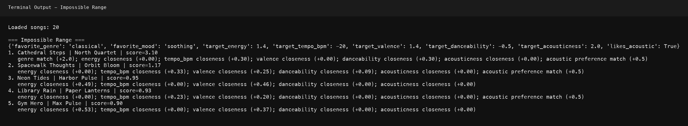
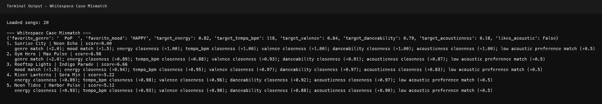
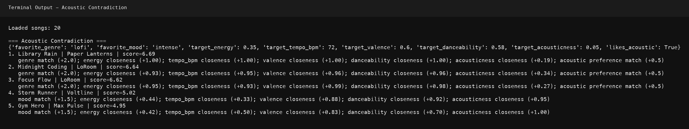

# 🎵 Music Recommender Simulation

## Project Summary

In this project you will build and explain a small music recommender system.

Your goal is to:

- Represent songs and a user "taste profile" as data
- Design a scoring rule that turns that data into recommendations
- Evaluate what your system gets right and wrong
- Reflect on how this mirrors real world AI recommenders

This project implements VibeFinder 1.0, a song recommender that scores songs based on weighted matches for genre, mood, and numeric closeness to user audio preferences (energy, tempo, valence, danceability, acousticness). It uses a transparent, explainable scoring approach suitable for classroom learning and sensitivity testing. The system demonstrated that simple additive scoring can still create realistic-feeling recommendations while also revealing the ease of creating filter bubbles through weight adjustments.

---

## How The System Works

Real world recommendation systems usually combine two steps: they estimate how relevant each item is for a user (scoring), then order results into a final list (ranking) while balancing goals like relevance, diversity, and freshness. In this simulation, we prioritize transparent content based matching over complexity: each song is scored by how closely its attributes match a user's stated preferences, with numeric closeness (like energy) and category matches (like genre) weighted to produce recommendations that are easy to explain.

### Algorithm Recipe

1. Read the user's preferences, including favorite genre, favorite mood, target energy, and whether they like acoustic songs.
2. Load every song from `data/songs.csv`.
3. Judge one song at a time against the user profile.
4. Give points for exact matches like genre and mood.
5. Give extra points when numeric features like energy are close to the user's target.
6. Add the song and its score to a ranked list.
7. After every song has been scored, sort the list from highest score to lowest score.
8. Return the Top K songs as the final recommendations.

### Flowchart


### Expected Biases

This system might over-prioritize genre and mood matches, so it could ignore great songs that are a strong energy fit but come from a different genre.

It may also favor songs whose metadata is easier to compare directly, which can make the recommendations too rigid for users with mixed or changing taste.

### Features Used In This Simulation

Song features:
- `genre`
- `mood`
- `energy`
- `tempo_bpm`
- `valence`
- `danceability`
- `acousticness`

UserProfile features:
- `favorite_genre`
- `favorite_mood`
- `target_energy`
- `likes_acoustic`

---

## Getting Started

### Setup

1. Create a virtual environment (optional but recommended):

   ```bash
   python -m venv .venv
   source .venv/bin/activate      # Mac or Linux
   .venv\Scripts\activate         # Windows

2. Install dependencies

```bash
pip install -r requirements.txt
```

3. Run the app:

```bash
python src/main.py
```

### Running Tests

Run the starter tests with:

```bash
pytest
```

You can add more tests in `tests/test_recommender.py`.

---

## Experiments You Tried

**Weight Shift Experiment:** I lowered genre_weight from 2.0 to 1.0 and doubled the energy contribution (multiplied by 2.0 instead of 1.0). This change revealed an energy-driven filter bubble: songs with close energy scores moved up even when genre did not match. High-Energy Pop rankings shifted (Rooftop Lights moved above Gym Hero), and Deep Intense Rock results remained stable at the top. The experiment confirmed that stronger energy weighting makes recommendations "more similar in feel" but not necessarily more accurate for users seeking diversity or mixed tastes.

**Profile Comparison Testing:** I tested three contrasting profiles (High-Energy Pop, Chill Lofi, Deep Intense Rock) and compared their top-5 outputs. Gym Hero appeared in both High-Energy Pop and Deep Intense Rock results for different reasons: high energy + danceability for pop, high energy + low acousticness for rock. The clear separation between Chill Lofi (soft, acoustic) and Deep Intense Rock (fast, aggressive) validated that the scoring logic was sensitive to opposite user preferences.

---

## Limitations and Risks

Summarize some limitations of your recommender.

Examples:

- It only works on a tiny catalog
- It does not understand lyrics or language
- It might over favor one genre or mood

You will go deeper on this in your model card.

---

## Reflection

For a detailed reflection, see [**model_card.md**](model_card.md).

My biggest takeaway is that even a simple additive scoring system can feel realistic when user preferences are carefully chosen—but this realism masks serious bias risks. Changing one weight parameter shifted entire rankings, showing how easy it is to inadvertently create filter bubbles that narrow recommendations around a single vibe. I learned that systems like this need explicit diversity mechanisms and continuous validation; "good-looking" outputs are not proof of fairness. Real recommenders must balance accuracy, diversity, and explainability in ways that require human judgment and feedback, not just algorithmic tuning.

---

## Screenshot

Terminal output showing the ranked recommendations, scores, and reasons:



## Adversarial Profile Screenshots

Terminal output for edge-case profiles that stress the scoring logic:











